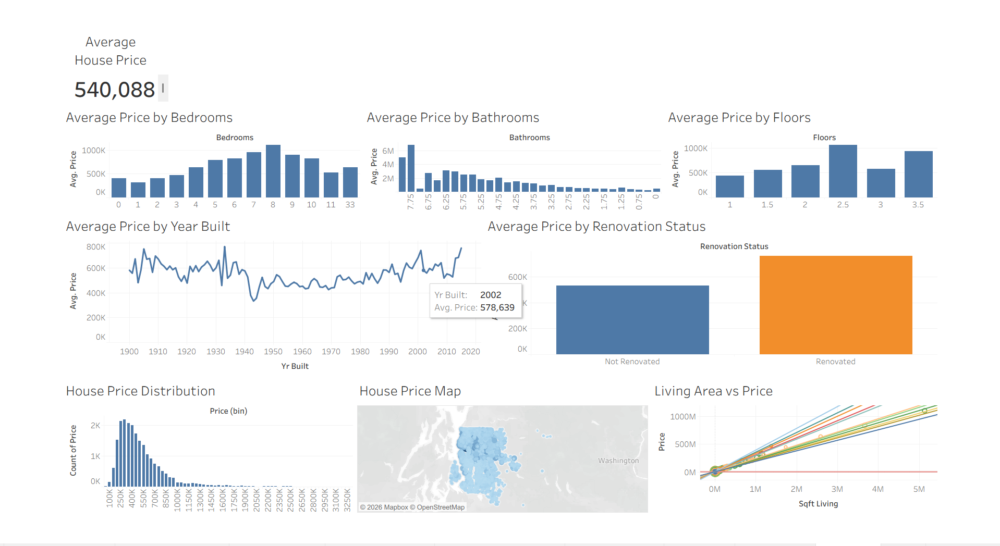
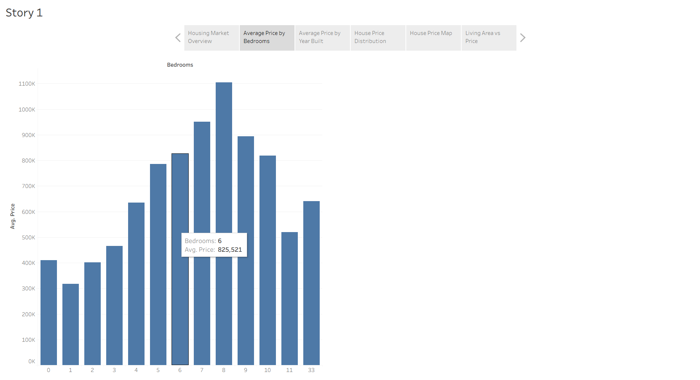
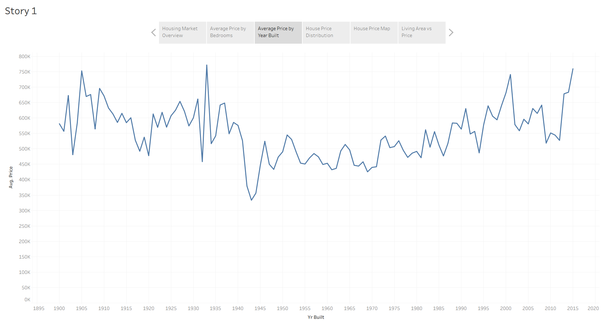
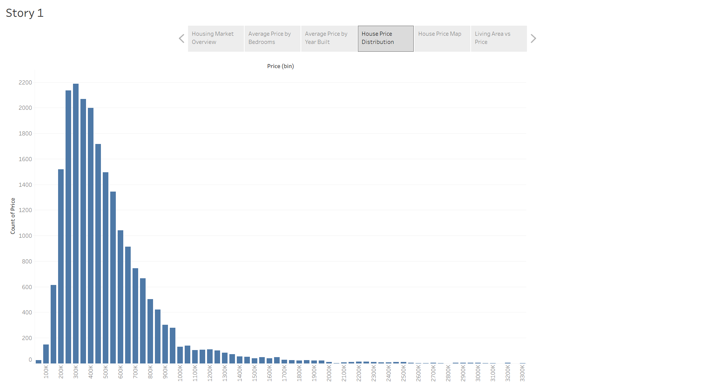
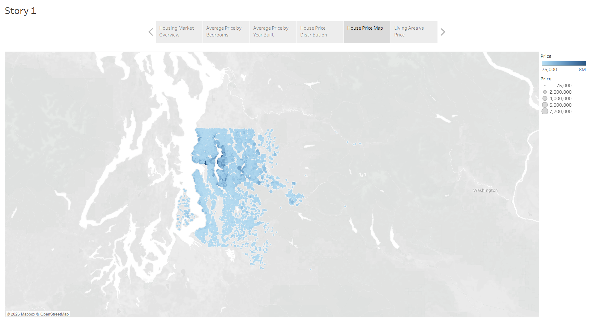
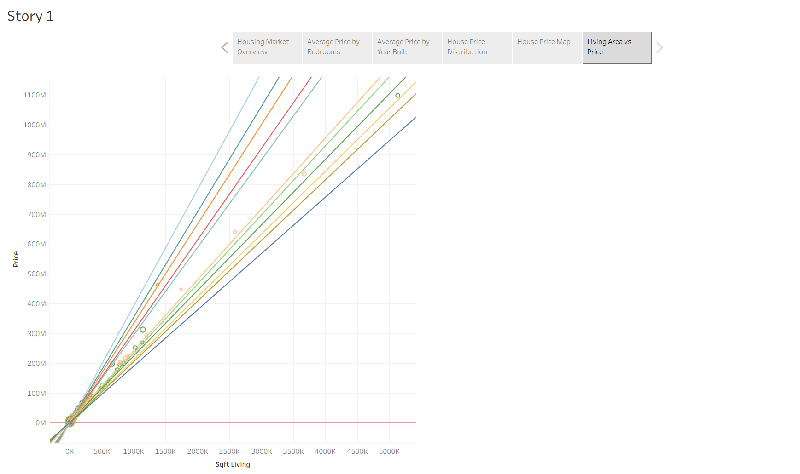

# 🏠 Housing Market Trends: An Analysis of Sale Prices and Features

## 📌 Project Overview

This project analyzes housing market trends by exploring the relationship between house sale prices and various property features such as bedrooms, bathrooms, floors, living area, renovation status, and year built.

The project was developed using **Tableau Public** for interactive visualizations and dashboards, and **Flask** for web integration.

---

## 🎯 Project Objectives

- Analyze housing market trends.
- Identify factors affecting house sale prices.
- Create interactive visualizations.
- Develop an interactive dashboard.
- Present insights through a Tableau Story.
- Embed the dashboard into a Flask web application.

---

## 🛠 Technologies Used

- Tableau Public
- Python
- Flask
- HTML5
- CSS3

---

## 📂 Dataset

**Dataset:** King County House Sales Dataset

**Total Records:** 21,613

### Features Used

- Price
- Bedrooms
- Bathrooms
- Floors
- Sqft Living
- Year Built
- Year Renovated
- Latitude
- Longitude

---

## 📊 Visualizations

The project includes the following visualizations:

- Average House Price
- Average Price by Bedrooms
- Average Price by Bathrooms
- Average Price by Floors
- Average Price by Year Built
- Average Price by Renovation Status
- House Price Distribution
- House Price Map
- Living Area vs Price

---

## 📈 Dashboard Features

- Interactive Dashboard
- Cross-filtering between visualizations
- House Price Map
- Distribution Analysis
- Trend Analysis
- Feature Comparison

---

## 📖 Tableau Story

The Tableau Story presents:

1. Housing Market Overview
2. Property Feature Analysis
3. Construction Year Analysis
4. Price Distribution
5. Geographic Analysis
6. Living Area vs Price Analysis

---

## 🌐 Tableau Public Dashboard

**Live Dashboard:**

https://public.tableau.com/app/profile/munikarthik.theertham/viz/HousingMarketTrendsAnalysis_17840789300850/Dashboard1?publish=yes

---

## 🚀 Flask Integration

The Tableau dashboard has been embedded into a Flask web application using HTML and CSS.

Project Structure:

```
Flask/
│── app.py
│── requirements.txt
│
├── templates/
│     └── index.html
│
└── static/
      └── style.css
```

---


## 📌 Key Insights

- Houses with more bedrooms and bathrooms generally have higher selling prices.
- Larger living areas are associated with higher market values.
- Renovated houses tend to have higher average prices.
- Premium-priced houses are concentrated in specific locations.
- Most houses fall within the mid-price range, while a smaller number of luxury houses create a right-skewed distribution.

---

## Dashboard Preview



## Story Preview











## 🔮 Future Enhancements

- Machine Learning-based price prediction.
- Real-time housing market data integration.
- Cloud deployment of the Flask application.
- Advanced analytics and additional dashboard filters.

---


---

## ⭐ If you found this project useful, feel free to star this repository!
